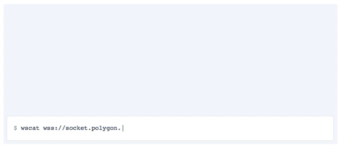

# Polygon.io Examples
Below are some examples of how to connect and use Polygon.io. Feel free to submit pull requests with your example code.

- [NodeJs](./websockets/nodejs/index.js)
- [GoLang](./websockets/golang/main.go)
- [C#](./websockets/cs/example.cs)
- [Python](./websockets/python/polygon.py)

---

### What is Polygon.io?
Polygon.io offers real-time, low latency streams to stock and forex markets.

Find out more: [Polygon.io](https://polygon.io/)
